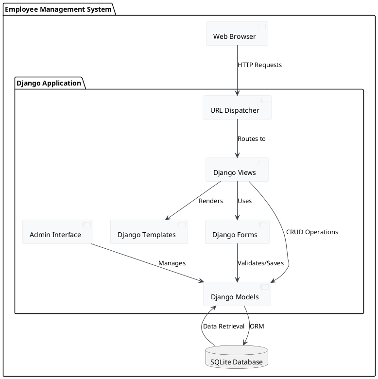
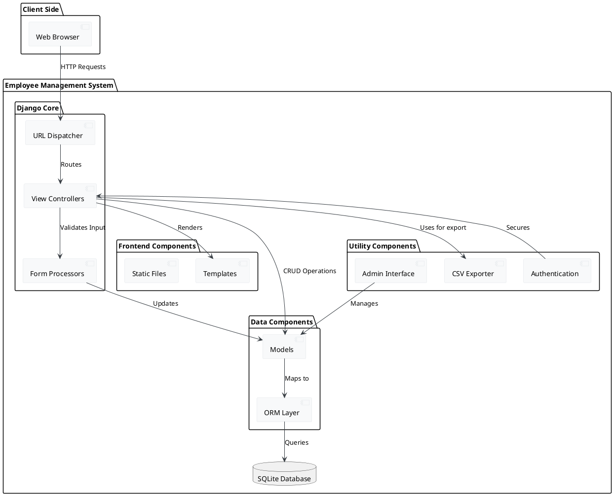
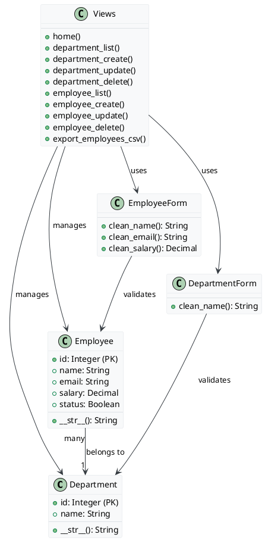
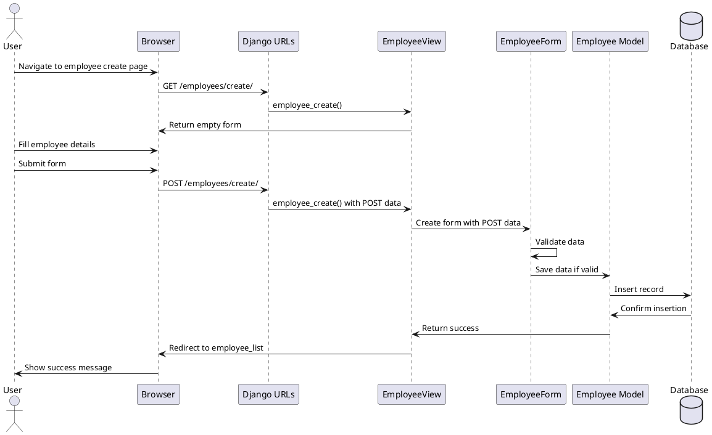
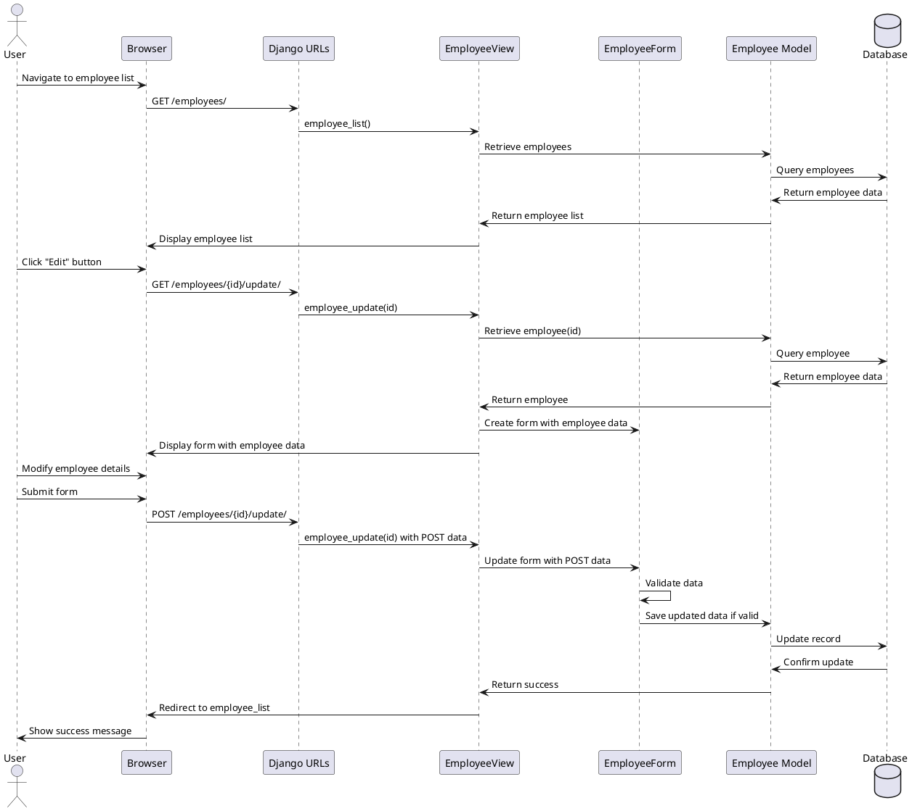
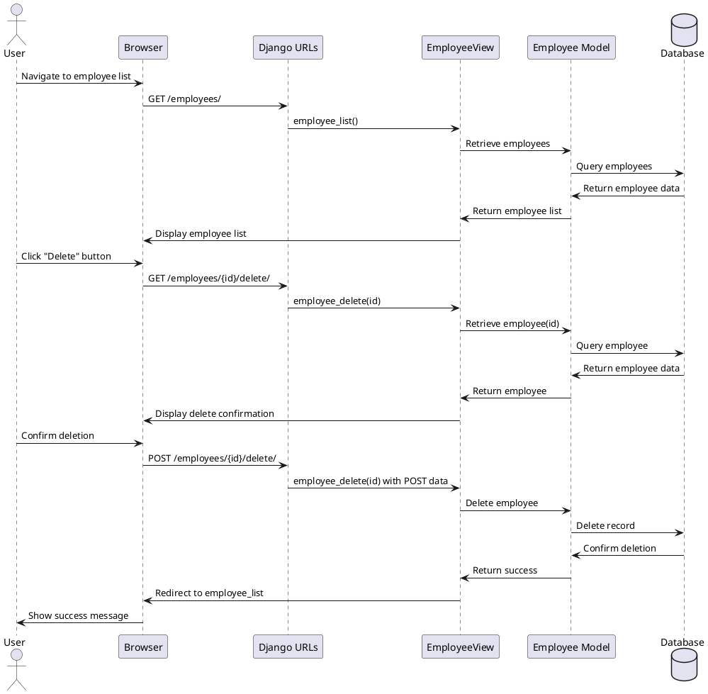
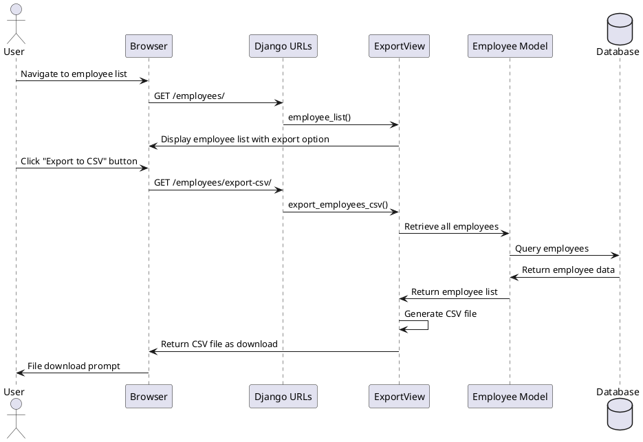
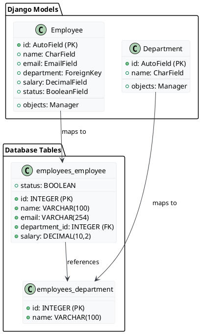
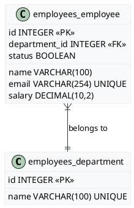

# Employee Management System - Technical Documentation

## Table of Contents

1. [Technology Stack](#technology-stack)
2. [Architecture](#architecture)
3. [Component Diagram](#component-diagram)
4. [Class Diagram](#class-diagram)
5. [Sequence Diagrams](#sequence-diagrams)
6. [ORM Diagram](#orm-diagram)
7. [ER Diagram](#er-diagram)

## Technology Stack

The Employee Management System (EMS) is built using the following technology stack:

| Component | Technology |
|-----------|------------|
| Backend Framework | Django 5.2.1 |
| Programming Language | Python |
| Database | SQLite |
| Template Engine | Django Templates |
| Form Handling | Django Forms |
| ORM | Django ORM |
| Frontend | HTML, CSS, JavaScript |
| User Authentication | Django Authentication System |

The system uses the Model-View-Template (MVT) architectural pattern, which is Django's version of the Model-View-Controller (MVC) pattern:
- **Models**: Define the data structure
- **Views**: Handle business logic and user interactions
- **Templates**: Render the UI for the users

## Architecture

The Employee Management System follows a three-tier architecture:

1. **Presentation Tier**: 
   - Web browser client that interacts with the system
   - Django Templates render HTML views to the client
   - Forms capture user input and handle validation

2. **Application Tier**:
   - Django Views process HTTP requests and implement business logic
   - URL Dispatcher routes requests to appropriate view functions
   - Django Forms handle data validation and processing
   - Django Admin provides administrative interface

3. **Data Tier**:
   - Django Models define data structure and relationships
   - SQLite Database stores all persistent data
   - Django ORM handles database interactions

The system follows RESTful principles for URL structure and HTTP methods:
- GET requests for viewing resources
- POST requests for creating/updating resources
- Django's CSRF protection for security

## Component Diagram

### Component Description:

1. **Frontend Components**:
   - **Templates**: Django HTML templates for rendering the UI
   - **Static Files**: CSS, JavaScript, and image assets

2. **Django Core**:
   - **URL Dispatcher**: Routes URLs to appropriate view functions
   - **View Controllers**: Process requests and implement business logic
   - **Form Processors**: Handle form validation and data processing

3. **Data Components**:
   - **Models**: Define data structures and relationships
   - **ORM Layer**: Maps Python objects to database tables

4. **Utility Components**:
   - **CSV Exporter**: Handles exporting employee data to CSV format
   - **Authentication**: Manages user authentication and authorization
   - **Admin Interface**: Provides administrative interface for data management

5. **Database**:
   - **SQLite Database**: Stores all persistent data

## Class Diagram

### Classes and Methods:

1. **Department**:
   - **Attributes**:
     - `id`: Integer, Primary Key
     - `name`: String (max_length=100, unique=True)
   - **Methods**:
     - `__str__()`: Returns department name as string representation

2. **Employee**:
   - **Attributes**:
     - `id`: Integer, Primary Key
     - `name`: String (max_length=100)
     - `email`: String (unique=True)
     - `department`: ForeignKey to Department
     - `salary`: Decimal (max_digits=10, decimal_places=2)
     - `status`: Boolean (default=True, choices=STATUS_CHOICES)
   - **Methods**:
     - `__str__()`: Returns employee name as string representation

3. **DepartmentForm**:
   - **Methods**:
     - `clean_name()`: Validates department name is not empty

4. **EmployeeForm**:
   - **Methods**:
     - `clean_name()`: Validates employee name is not empty
     - `clean_email()`: Validates email is not empty
     - `clean_salary()`: Validates salary is not negative

5. **Views**:
   - **Methods**:
     - `home()`: Renders home page
     - `department_list()`: Lists all departments
     - `department_create()`: Creates new department
     - `department_update()`: Updates existing department
     - `department_delete()`: Deletes department
     - `employee_list()`: Lists all employees with filtering
     - `employee_create()`: Creates new employee
     - `employee_update()`: Updates existing employee
     - `employee_delete()`: Deletes employee
     - `export_employees_csv()`: Exports employee data as CSV

## Sequence Diagrams

### 1. Employee Creation Process

#### Employee Creation Process Description:
* User navigates to the employee creation page
* System displays an empty employee form
* User fills in employee details (name, email, department, salary, status)
* User submits the form
* System validates the form data
* If validation passes, system creates a new employee record
* System redirects to employee list page with success message
* If validation fails, system redisplays the form with error messages

### 2. Employee Update Process

#### Employee Update Process Description:
* User navigates to the employee list page
* System displays list of employees
* User clicks "Edit" button for specific employee
* System retrieves employee data and displays pre-filled form
* User modifies employee details
* User submits the form
* System validates the form data
* If validation passes, system updates the employee record
* System redirects to employee list page with success message
* If validation fails, system redisplays the form with error messages

### 3. Employee Deletion Process

#### Employee Deletion Process Description:
* User navigates to the employee list page
* System displays list of employees
* User clicks "Delete" button for specific employee
* System displays delete confirmation page
* User confirms deletion
* System deletes employee record
* System redirects to employee list page with success message
* If user cancels, system returns to employee list without deleting

### 4. Export Employees to CSV Process

#### Export Employees to CSV Process Description:
* User navigates to the employee list page
* System displays list of employees with export option
* User clicks "Export to CSV" button
* System retrieves all employee data
* System generates CSV file with employee data
* System sends CSV file to browser as download
* Browser prompts user to save or open the file

## ORM Diagram

### ORM Description:

The Django ORM (Object-Relational Mapping) maps Python classes to database tables:

1. **Department Model**:
   - Maps to `employees_department` table in the database
   - **Fields**:
     - `id`: AutoField (Primary Key), automatically incremented
     - `name`: CharField (max_length=100, unique=True), stores department name
   - **Manager**:
     - `objects`: Default model manager for database operations
   - **Queries**:
     - `Department.objects.all()`: Retrieves all departments
     - `Department.objects.get(pk=id)`: Retrieves specific department by primary key
     - `Department.objects.filter(name__contains=query)`: Filters departments by name

2. **Employee Model**:
   - Maps to `employees_employee` table in the database
   - **Fields**:
     - `id`: AutoField (Primary Key), automatically incremented
     - `name`: CharField (max_length=100), stores employee name
     - `email`: EmailField (unique=True), stores employee email
     - `department`: ForeignKey to Department, creates relationship
     - `salary`: DecimalField (max_digits=10, decimal_places=2), stores salary
     - `status`: BooleanField (default=True), stores active/inactive status
   - **Manager**:
     - `objects`: Default model manager for database operations
   - **Queries**:
     - `Employee.objects.all()`: Retrieves all employees
     - `Employee.objects.get(pk=id)`: Retrieves specific employee by primary key
     - `Employee.objects.filter(name__contains=query)`: Filters employees by name
     - `Employee.objects.filter(department=department_id)`: Filters employees by department
     - `Employee.objects.filter(status=True)`: Filters active employees

The Django ORM handles:
- Database schema creation and migration
- SQL query generation
- Data validation
- Relationship management
- Data retrieval with lazy loading

## ER Diagram

### Database Tables and Fields Description:

1. **employees_department**:
   - **Purpose**: Stores department information
   - **Fields**:
     - `id` (INTEGER): Primary key, auto-incremented
     - `name` (VARCHAR(100)): Department name, unique constraint

2. **employees_employee**:
   - **Purpose**: Stores employee information
   - **Fields**:
     - `id` (INTEGER): Primary key, auto-incremented
     - `name` (VARCHAR(100)): Employee name
     - `email` (VARCHAR(254)): Employee email address, unique constraint
     - `department_id` (INTEGER): Foreign key referencing employees_department.id
     - `salary` (DECIMAL(10,2)): Employee salary with 2 decimal places
     - `status` (BOOLEAN): Employee status (True=Active, False=Inactive)

3. **Relationships**:
   - One-to-Many relationship between Department and Employee
   - A Department can have many Employees
   - An Employee belongs to exactly one Department
   - Foreign key constraint ensures referential integrity
   - Cascade delete: When a Department is deleted, all associated Employees are also deleted

4. **Constraints**:
   - Primary key constraints on `id` fields
   - Unique constraints on `name` field in Department table
   - Unique constraint on `email` field in Employee table
   - Foreign key constraint on `department_id` in Employee table
